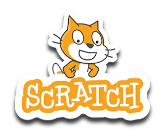

# Scratch
Introdução a lógica de Programação 
## Autor
Julia Picole Turubia
## Projetos
- [Cáculo da Média](https://scratch.mit.edu/projects/881963507)
- [Porcentagem](https://scratch.mit.edu/projects/882637426)
- [Fahrenheite para Celsius](https://scratch.mit.edu/projects/882611802)
- [Caixa de Dinheiro](https://scratch.mit.edu/projects/883243920)
- [Libra em Kg](https://scratch.mit.edu/projects/885238575)
- [Milha em KM](https://scratch.mit.edu/projects/885293817)
- [Custo, Lucro e Venda](https://scratch.mit.edu/projects/885296304)
- [Cálculo Hora de Serviço](https://scratch.mit.edu/projects/885298628)
- [Cáuculo Estimativa](https://scratch.mit.edu/projects/886840793)
- [Alcool ou Gasolina](https://scratch.mit.edu/projects/887235810)
- [Circuito AND](https://scratch.mit.edu/projects/888053943)
- [Circuito OR](https://scratch.mit.edu/projects/888073613)
- [Circuito NOT](https://scratch.mit.edu/projects/888070273)
- [Litros do Aquário](https://scratch.mit.edu/projects/888448041)

  
## Certificado Code

